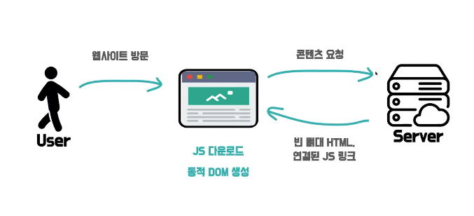

# 0509 - 0515 WIL
## 한일
### 항해 99 Start!!
### 미니프로젝트 My Hidden Song
  - Python( Flask ), HTML, JavaScript
  - AWS, MongoDB
  - Github, Sourcetree, Pycharm
### 알고리즘
- Programmers [[링크]](https://programmers.co.kr/learn/challenges)
- 20번 문제를 제외하고 28번까지 풀이 완료 
- 챌린저 스터디(강현구, 이가연)
  - 하루에 한문제, 저녁 9시에 코드리뷰
  - 30번, 32번
## What I Learned
### Flask
- 파이썬의 웹 프레임워크
- 가볍고 코드도 비교적 단순함
- API 관련 확장 기능들이 많아서 API 서버 만들기 편리함
- 폴더 안에 위치한 templates 서브 폴더에서 템플릿을 검색하여 그곳의 HTML 파일을 이용하여 렌더링 
```python
from flask import Flask 

app = Flask(__name__)

@app.route("/path")        # path url로 들어오면
def hello():
    print("Hello World")
    return render_template('page.html')      # page.html 을 렌더링
    

@app.route("/path2")
def pageA():
    print("Hello World2")
    # url_for(url에 연결된 함수명, 전달할 인자값) pageB 함수가 있는 url로 이동 (path3)
    return redirect(url_for('pageB'))   

@app.route("/path3/<test_data>", methods = ['GET']) # test_data를 url로 받음  
def pageB(test_data):
    print(test_data)
    navigation = [{'href':'href1', 'caption':'caption1'}]
    a_variable = 'variable1'
    return render_template('page3.html',testdata=test_data, navigation = navigation, a_variable = a_variable)   #page3.html 을 렌더링 할때 test_data 데이터 전달

```
### jinja2 
- 파이썬의 템플릿 엔진
- 상속(extends) 을 사용해 레이아웃 처리
- 페이지 렌더링시 python 을 사용하여 데이터 처리
```html

//head.html
<!DOCTYPE html>
<html lang="en">
<head>
    
    <title>head</title>
    
</head>
<body>


Head Page!




</body>
</html>
//////////////////////////////////////////////////
//page3.html



변경하고자 하는 소스코드
...



<title>page3</title>



    <ul id="navigation">
             {# app.py 에서 받은 데이터로 for 문 사용 #}
        <li><a href="{{ item.href eor">{{ item.caption }}</a></li>
        
    </ul>

    <h1>Page3</h1>
    {{ a_variable }}

    {# a comment #}

```

### JWT
#### Json Web Token
#### 장점
- 유저 데이터를 클라이언트에 저장, 클라이언트에서 저장,조회는 가능하지만 수정은 서버에서만 가능
- 서버 데이터에 대한 부담 감소
```json
JhbGci0i.tZSI6IKp.fwpMeJf36
{Header}.{Payload}.{Signature}

헤더에는 어떤 타입의 데이터를 다룰지, 어떤 암호화 해싱 알고리즘을 사용할지에 대한 정보가 담김
암호화가 되어 있는것 처럼 보이지만 실제로는 base64 포멧으로 변환만 한것임
        
payload json 형식으로 실제 사용할 데이터가 담김
Payload ex)
{
  "name" : "Ean",
  "age" : 1992,
  "size" : 15,
  "money" : 10000000000000000,
  "expiredAt" : "2020-01-01"
}

signature 유저는 데이터를 보기만 할 수 있고 서버에서만 수정할 수 있게 되는걸 가능하게 함
클라이언트에서는 건드릴 일이 없고 그대로 주고받기만 하는 데이터
서버에서만 관리함 조작여부를 확인함
Signature ex)
HMASCHA256{
  base64UrlEncode(header) + "." +
  base64UrlEncode(payload),
  {secret key}
}

```
#### 단점
- 로그인 정보를 서버에 저장하지 않기 때문에 중복로그인, 강제 로그아웃 등이 불가능
- 토큰이 유출 된다면 만료시킬 수가 없으니 위험함
#### 해결법
- 대칭키 암호화 방식
  - 보호할 데이터에 대한 비밀번호를 정하고 암호화, 비밀번호를 모른다면 복호화를 하지 못하여 데이터를 알 수 없음.
  - jwt와 대칭키 암호화 조합
- 보관은 클라이언트가 하지만 클라이언트가 데이터를 읽을 수 없게 서버에서 일부 데이터를 대칭키 암호화함

## CSR 과 SSR
### CSR (Client Side Rendering)
SPA(Single Page Application) 에서 주로 사용됨  
React, Vue, Angler   
  

  
  

### SSR (Server Side Rendering)
MPA(Multi Page Application) 에서 주로 사용됨  
php, JSP  
SSG 와는 다르게 서버에서 요청 시 즉시 만듦  
데이터가 자주 바뀌는 미리 만들어 두기 어려운 페이지에 적합  
  

ajax에 비해 추가적인 통신 없이 서버 데이터를 받아 올 수 있음
코드가 직관적이고 간결해짐
템플릿 상속 기능을 이용하여 공통된 헤더, 푸터 부분을 한 파일로 관리가 가능함
모든 데이터가 서버에서 HTML에 담겨진 후에 브라우저로 전달 되기 때문에 검색엔진 최적화에 유리함
JS데이터를 다운 받기 전에 HTML이 렌더링 되므로 초기 구동 속도가 빠름

### SSG (Static Site Generation)
SSR 과 다르게 서버에서 요청 시 미리 만들어 놓음  
바뀔일이 거의 없는 페이지에 적합
## 디바운스(debounce), 쓰로틀(throttle)
### 디바운스 (debounce)
어떤 내용을 입력하다가 일정 시간 동안 대기하고 있으면 마지막에 입력된 내용을 서버에 요청을 보내는 방법. 구글 검색창에 입력을 멈추면 연관검색어 목록이 나타남.
```JavaScript
function debounce(func, delay) {
  let inDebounce;
  return function(...args) {
    const context = this;
    if (inDebounce) {
      clearTimeout(inDebounce);
    }
    inDebounce = setTimeout(
      () => func.call(context, ...args),
      delay);
  }
}
// const run = debounce(val => console.log(val), 100);
// run('a');
// run('b');
// run('2');
// .... 100ms이후
```

```JavaScript
var debounce = null;
var throttle = null;
function keyUpFn(el) {
  // normal
  console.log('normal', el.target.value, new Date().getTime());
  // debounce
  clearTimeout(debounce);
  debounce = setTimeout(() => {
    console.log(
      'debounce',
      el.target.value, new Date().getTime());
  }, 500);
  // throttle
  if(!throttle) {
    setTimeout(() => {
      console.log('throttle', throttle, new Date().getTime());
      throttle = null;
    }, 500);
  }
  throttle = el.target.value;
}
document.getElementById("search").addEventListener('keyup', keyUpFn);
```
### 스로틀 (throttle)
디바운스와 비슷한 개념이지만 입력되는 동안에도 바로 이전에 요청한 작업을 주기적으로 실행함. 보통 무한 스크롤 기능을 구현할 때 사용
```JavaScript
export function throttle(func, delay) {
  let lastFunc;
  let lastRan;
  return function(...args) {
    const context = this;
    if (!lastRan) {
      func.call(context, ...args);
      lastRan = Date.now();
    } else {
      if (lastFunc) clearTimeout(lastFunc);
      lastFunc = setTimeout(function() {
        if ((Date.now() - lastRan) >= delay) {
          func.call(context, ...args);
          lastRan = Date.now();
        }
      }, delay - (Date.now() - lastRan));
    }
  }
}
var checkPosition = () => {
  const offset = 500;
  const currentScrollPosition = window.pageYOffset;
  const pageBottomPosition = document.body.offsetHeight - window.innerHeight - offset;
  if (currentScrollPosition >= pageBottomPosition) {
    // fetch('/page/next');
    console.log('다음 페이지 로딩');
  }
};
var infiniteScroll = throttle(checkPosition, 300);
window.addEventListener('scroll', infiniteScroll);
```

## JAVA
-  String은 primitive 자료형이 아님 [참고자료](https://wikidocs.net/205)
-   리터럴 값이란 변수를 선언할 때 사용하는 'a' , 10 등 변수, 상수들을 초기화 할 때 적는 값들  
    변수가 아닌 상수 또는 리터럴간의 연산은 프로그램 실행 중 변하는 값이 아니기 때문에, 소스코드를 컴파일 시 컴파일러가 먼저 계산하고 리터럴간의 연산을 실행 한다

|컴파일 전|컴파일 후|
  |:-----:|:-----:|
|char c = 'a' + 1;|char c = 'b'|
|int i = 100 * 100;|int i = 10000;|
> 이처럼 'a' + 1; 과 같은 연산은 리터럴간의 연산으로 컴파일러는 연산을 미리 실행하여 char c = 'b' 로 나타나게 된다.(아스키 코드 연산)  
수식에 변수가 들어가 있는 경우에는 프로그램 사용 도중 값이 변할 수도 있기 때문에 컴파일러가 미리 계산을 할 수 없다.


  ```Java
  // JAVA
  // s가 무엇인지 모르기 때문에 컴파일러가 미리 계산 할 수 없음.
  answer = s.charAt(2) + s.charAt(3);
  answer = "a" + "b";
  
  // 아스키 코드 값으로 연산되어 int 반환함
  System.out.print("ab".charAt(0) + "bc".charAt(0)); 
  // 195 출력
  
  // 문자열로 연산되어 String 반환함
  System.out.print("" + "ab".charAt(0) + "bc".charAt(0));
  // "ab" 출력
  ```

- 배열, 리스트, ArrayList, LinkedList [참고자료](https://velog.io/@adam2/Array%EC%99%80-List%EA%B7%B8%EB%A6%AC%EA%B3%A0-Java-List)
